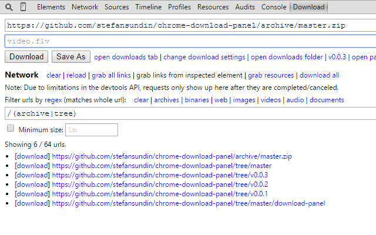

# Chrome Download Panel 

Adds a download panel to your devtools!

Chrome Web Store: https://chrome.google.com/webstore/detail/download-panel/dfkcgjijchipieeogdonnjbhlhjphbfn

When this extension fails to do the job, you can try [Chrono Download Manager](https://chrome.google.com/webstore/detail/chrono-download-manager/mciiogijehkdemklbdcbfkefimifhecn). Then file an issue and let me know how I can improve this extension. :)

Icon from: http://www.iconarchive.com/show/100-flat-icons-by-graphicloads/download-3-icon.html

# Screenshot

# Tips
- If you have an url copied when opening the download panel, it will be pasted to the url field automatically.
- End filename with `/` to automatically append filename from url.
- Middle-click `[download]` link to open save-as dialog.
- Middle-click url to open link url in new tab.
- Inspect an element and a badge will appear in the filename text field. Click it to use the text contents as your filename.

# Changelog

[ Release feed](https://github.com/stefansundin/chrome-download-panel/releases.atom)

**v0.1.1** - 2016-01-12 - [diff](https://github.com/stefansundin/chrome-download-panel/compare/v0.1.0...v0.1.1):
- Inspect an element and a badge will appear in the filename text field. Click it to use the text contents as your filename.
- Check inspected element on startup.

**v0.1.0** - 2016-01-10 - [diff](https://github.com/stefansundin/chrome-download-panel/compare/v0.0.4...v0.1.0):
- Add indicators if url has been downloaded already.
- Add checkbox to automatically start downloads.
- Add option to reverse lists.
- No longer clear url and filename fields when download starts.

**v0.0.4** - 2015-11-01 - [diff](https://github.com/stefansundin/chrome-download-panel/compare/v0.0.3...v0.0.4):
- Fix "undefined" in grab-inspected-links link text.
- You can now end the filename field with `/` and the extension will automatically try to extract a filename from the url.
- If you leave out the file extension in the filename field, it will be extracted from the url if possible.
- Add _Clear list on navigation_ checkbox.

**v0.0.3** - 2014-12-17 - [diff](https://github.com/stefansundin/chrome-download-panel/compare/v0.0.2...v0.0.3):
- Add ability to grab urls from links on the page, either all links or only links that is within the element you are inspecting.
- Add ability to grab the list of loaded resources.
- Prevent Esc key from bringing up the console when editing text fields. The Esc key clears the text field instead.

**v0.0.2** - 2014-12-11 - [diff](https://github.com/stefansundin/chrome-download-panel/compare/v0.0.1...v0.0.2):
- Add network capture feature, with regex filtering and predefined filters.
- Add history feature.
- Add icon.

**v0.0.1** - 2014-12-08:
- First release.
